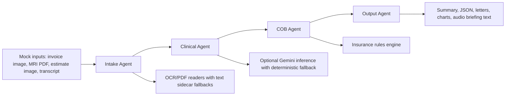

# DuCO-Agent Architecture

## Agent Boundaries

- Intake Agent reads source files and produces structured claims. It does not decide medical necessity or payment.
- Clinical Agent enriches claims with diagnosis, CPT, ICD-10, and preauthorization status. It does not calculate COB payments.
- COB Agent applies payer-order and payment rules. It does not parse files or write deliverables.
- Output Agent writes patient-facing and insurer-facing artifacts. It does not change business rules.

## Why Multi-Agent

The problem combines document extraction, clinical reasoning, financial adjudication, and deliverable generation. Separate agents keep these concerns testable and explainable while the state machine still runs end to end.
