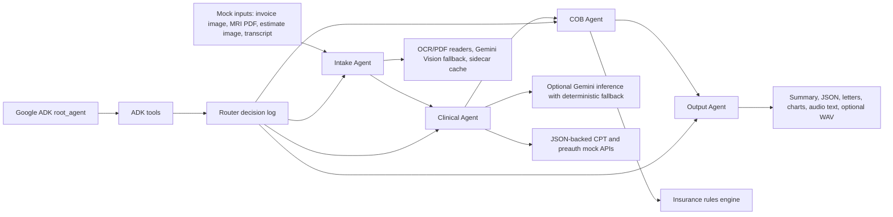

# DuCO-Agent Architecture

## Agent Boundaries

- Intake Agent reads source files and produces structured claims. It does not decide medical necessity or payment.
- Clinical Agent enriches claims with diagnosis, CPT, ICD-10, and preauthorization status. It does not calculate COB payments.
- COB Agent applies payer-order and payment rules. It does not parse files or write deliverables.
- Output Agent writes patient-facing and insurer-facing artifacts. It does not change business rules.

## Why Multi-Agent

The problem combines document extraction, clinical reasoning, financial adjudication, and deliverable generation. Separate agents keep these concerns testable and explainable while the state machine still runs end to end.

## Router Decisions

Before each agent runs, the controller records a router decision with the selected action, prerequisite state, and reason. This keeps the workflow auditable: the run log shows not only that an agent ran, but why it was eligible to run. If required upstream state is missing, the router records a skip decision instead of blindly calling the next agent.

If an agent fails validation after bounded retries, the controller stops the workflow and records skip decisions for downstream agents. For example, failed intake prevents clinical, COB, and output execution; failed clinical validation prevents COB and output execution.

When Gemini is configured, the controller can add an LLM judge validation event to the trace. Deterministic validation and structured contracts still remain the primary guardrails.

## Google ADK Wrapper

The project includes a Google ADK entry point under `adk_duco_agent/agent.py`.
It defines `root_agent` and exposes tool functions that call the same deterministic
workflow:

- `run_duco_analysis`
- `get_duco_report`
- `list_duco_agent_traces`

This keeps the ADK-facing interaction agentic while preserving deterministic COB
math and validation inside the existing Python agents.
